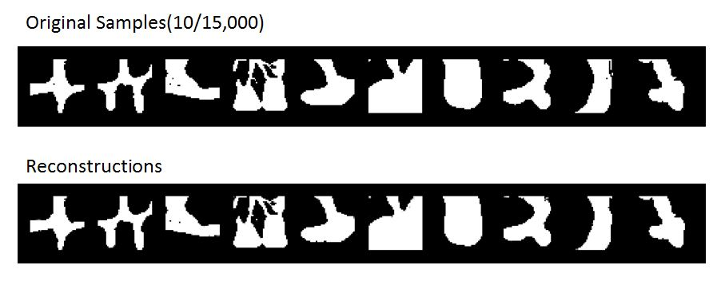
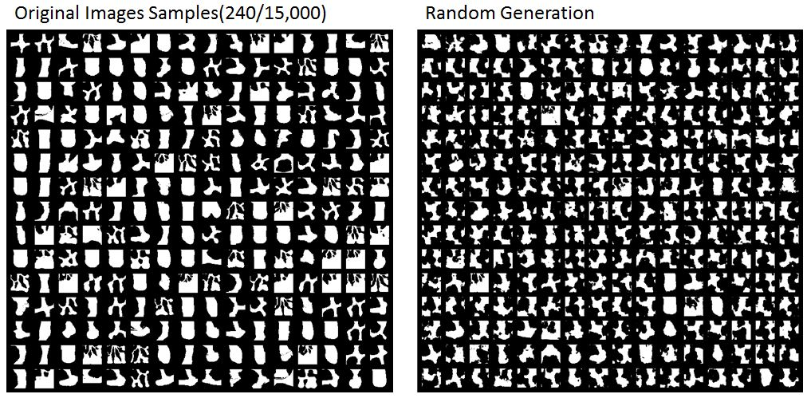
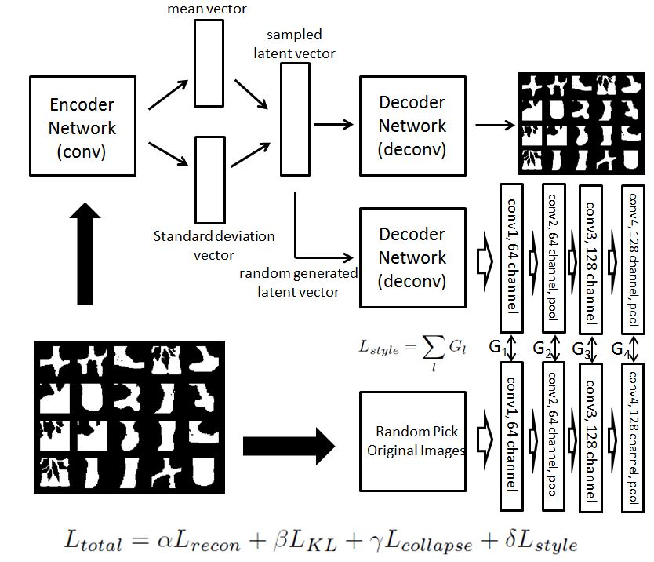
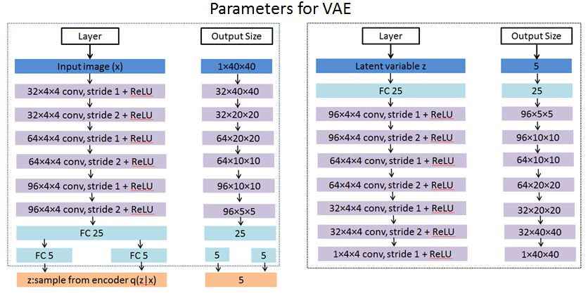

# StyleTransfer-VAE
# Summary of the proposed VAE + Style Transfer Network
## Purpose
The proposed VAE + Style Transfer Network is trained to be a generator, 
which could help us generate images with similar style compared with input samples and also the network could reconstruct the original images
, unlike GAN which couldn't satisfy the reconstruction requirement. In our case we have 15K input images with size 40 by 40:

## Model
We set up a 16-layer VAE network + a 4-layer Style Transfer network.

### detail parameter
- VAE:

- Style Transfer: 

We use the first 4 layers from the pretrained VGG network, due to our image size is 40 by 40.
This number could be adjusted based on your input size.

- Error Term:

In this case we have 4 error terms: (a)Reconstruction Error, (b)KL-Divergence Error, (c)Model Collapse Error and (d)Style Transfer Error.
Error (a)(b) are traditional error terms for VAE; Error (c) is used for preventing model from collaps(Please refer to the paper [Improved GAN](https://arxiv.org/abs/1606.03498)
for technique detail; Error (d) is the difference between Gram matrix from input samples and generated images(in our case, we randomly pick
a batch from 15K input samples in every epoch as comparing target), please refer to [Style Transfer](http://www.cv-foundation.org/openaccess/content_cvpr_2016/html/Gatys_Image_Style_Transfer_CVPR_2016_paper.html)
for techique detail.

## Pre-request for Running the code
### Package
- Cuda >= 6.5
- Python >= 2.7
- Tensorflow >= 1.0
- Keras
- h5py

### Download
Please download VGG pretrained weights from [https://github.com/fchollet/deep-learning-models/releases](https://github.com/fchollet/deep-learning-models/releases)

