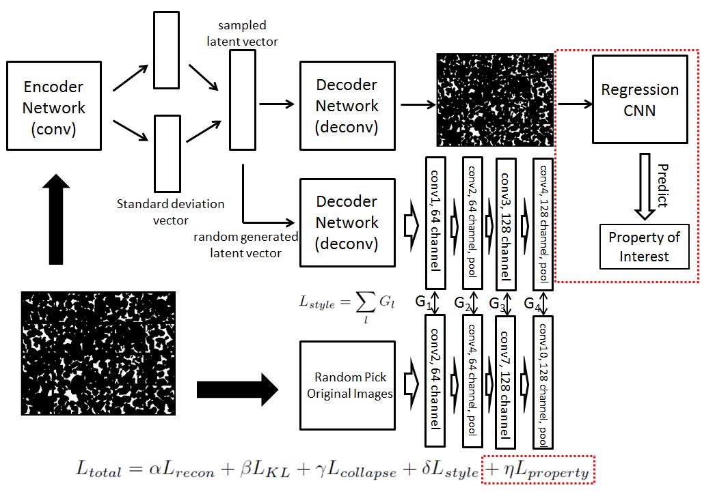

# StyleTransfer-VAE
# Summary of the proposed VAE + Style Transfer Network
## Purpose
The proposed VAE + Style Transfer Network is trained to be a generator, 
which could help us generate images with similar style compared with input samples and also the network could reconstruct the original images, unlike GAN which couldn't satisfy the reconstruction requirement.

## Case Study I:
- VAE + Style Transfer(file VAE+ST)

## Case Study II:
- VAE + Style Transfer + Supervised Learning (file VAE+ST+SL)

